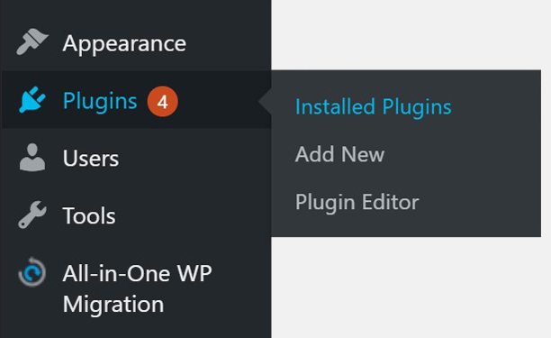
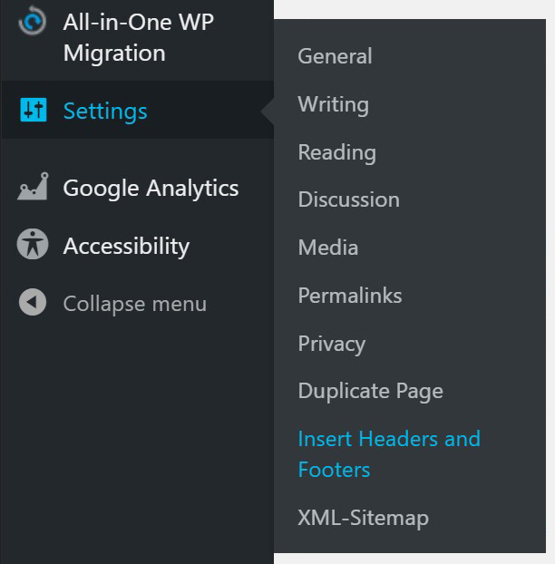
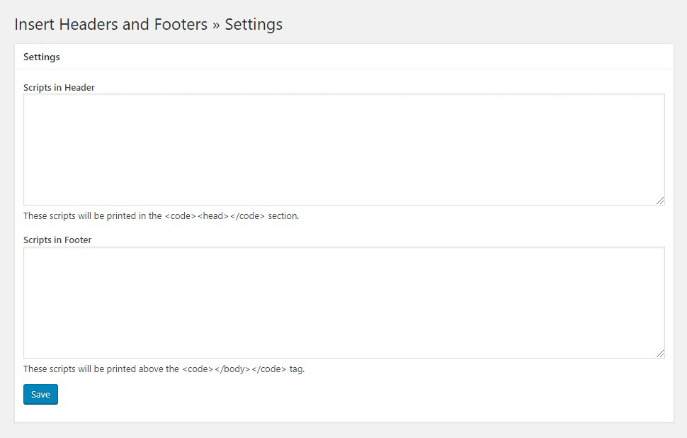
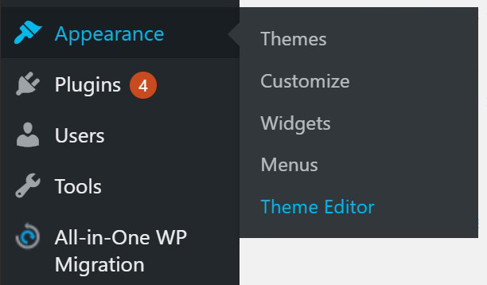
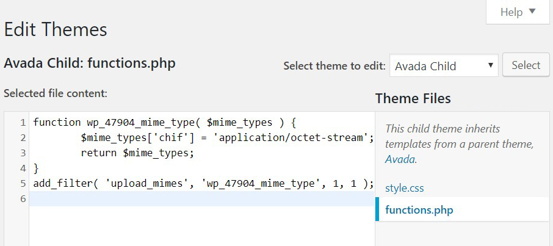
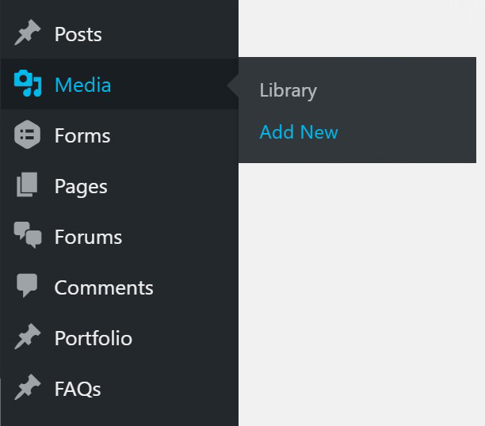
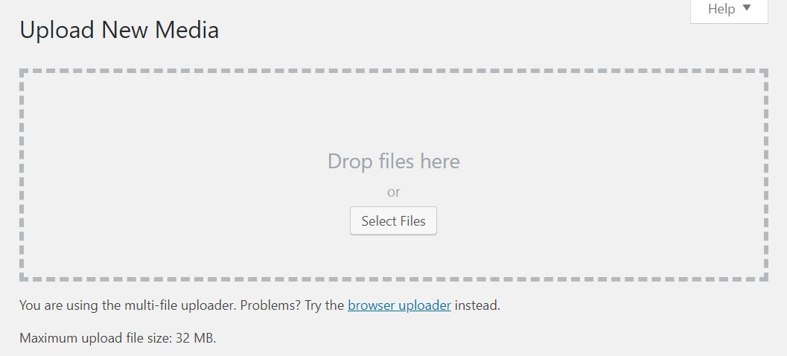
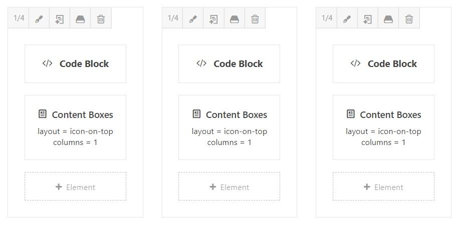
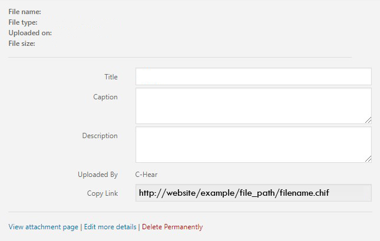

## Wordpress integration example

This tutorial will help you start embedding CHIF files into a WordPress site.

Note: Before beginning this tutorial, be sure you are using a WordPress theme that allows the use of Code Blocks.

## 1. Importing Scripts

In order for CHIFs to work in your site you will need to install some scripts we've written.

First, login to your site's dashboard.

In the left vertical menu look for the Plugins menu item with a picture of a plug next to it.

Hover over Plugins until a dropdown menu shows "Installed Plugins" and then click that.



Make sure you have the plugin titled "Insert Headers and Footers" which will look like this:


If you don't have this, go to the top of this screen and click the "Add New" button and add this plugin before proceeding.



Once you have this plugin installed, look again in the left vertical menu for the settings menu item.

Hover over settings and now you should see a dropdown list appear that includes your new plugin, "Insert Headers and Footers."

Once you open this plugin, this is what it should look like in WordPress:



Inside of the "Scripts in Header" section, paste the following two lines of code:

```html
<script type='text/javascript' src="https://storage.googleapis.com/chif-player/chifPlayer-3.0.5.js"></script>

```

Inside of the "Scripts in Footer" section, paste the following line of code:

```html
<script>window.chifPlayer.streamFiles();</script>
```

After that simply click the "Save" button in blue at the bottom left of this screen.

## 2. Adding PHP to Make CHIFs Work

Go back to the dashboard.

In the left vertical menu hover over Appearance with the paintbrush icon.

From there a drop down menu will appear. Click theme editor.




Add a functions.php file including the following code:

```php
<?php

    function wp_47904_mime_type( $mime_types ) {
        $mime_types['chif'] = 'application/octet-stream';
        return $mime_types;
    }
    add_filter( 'upload_mimes', 'wp_47904_mime_type', 1, 1 );
```    

This is what it should look like in WordPress:



After that simply click "Update File" in blue at the bottom left of this screen.

## 3. Adding CHIF Files

Go to the "Media" section in the left vertical menu with the camera and music notes icon.

Click "Add New"



An option to drag and drop a file or press "Select Files" to view them in the hard drive folder will appear.



Because CHIF files are so new they are not yet recognized by WordPress's uploader. To get around this simply use the drag and drop method. Do not press the "Select Files" button as it will not recognize CHIF files as options to select.

## 4. Using Code Blocks

For each CHIF file you have to add a code block with the code for the CHIF file inside of it.

To do this go to the page you'd like to add the CHIF file and add a Code Block element. As an example, here is our setup similar to the HTML demo where we have three CHIFs (you'll also notice the paragraph blocks beneath the images):



Each of these code blocks will create a CHIF file. In order to do that go to the Media Library and open the CHIF file you'd like to display.

Once you have opened the CHIF file in the Media Library you will see a screen with a panel to the right similar to this:



Notice the "copy link" area; (copy all the text in the link).

Now it's time to paste this where we want our CHIF file in the code block. Navigate to the location of your page you want to place the CHIF file and open up a code block by clicking on it to edit it using the pen icon.

All you have to do now is paste the following code into your div:

```html
<chear src="chif_file_source_path"></chear>
```

Be sure to use the text you copied from the CHIF file in the media section as your source (everything inside the quotation marks) where our example has "chif_file_source_path".
That's it!

If all went well then you should now see your CHIF file displaying.

If you've have any trouble please reach out to us for any further assistance by visiting our site and heading to the "For Developers" menu option! We're always on standby happy to help.